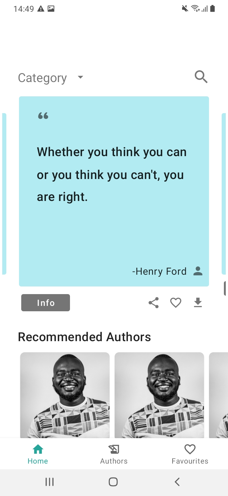
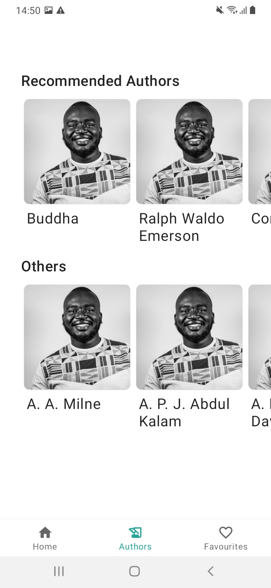
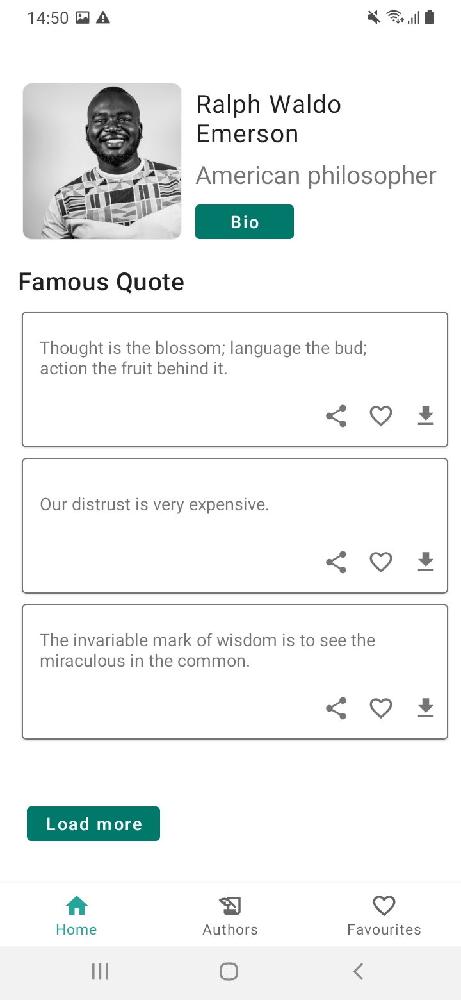
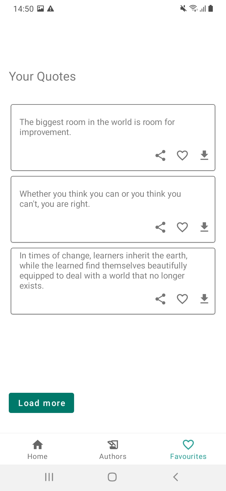

# Kyosk Android Test
An Android Application interacting with [Quotable](https://github.com/lukePeavey/quotable). It enabling users to read quotes, save favourite quotes and get to know various authors.  

## Development Environment
* Android Studio Arctic Fox | 2020.3.1 Patch 3
* Language: Kotlin
* Build System: Gradle

## Architecture
Clean architecture helps organizing the project into different layers so that it's easy to understand, scale and debug when need arises.
There are [Multiple ways of defining Clean Architecture layers](https://proandroiddev.com/multiple-ways-of-defining-clean-architecture-layers-bbb70afa5d4a).
In this application i have used Clean Architecture per module. 

The project is divided into 3 layers
* domain
* data
* app

### Domain
This is the layer that contains all the business logic. It contains all the abstract definition and the inner most.In this project the domain layers holds the definitions of use-cases/iteractors, domain data models and repository interfaces. 

```usecases/ interactors```  they are the business logic executors that converts and passes user actions like fetch data from data source either remote or local and gives it back to the requester, in this case its the presenter (app).
the act as mediators between the repository and data layer

```repository interface``` interface that must be implemented by data layer

### Data
This layer contains three modules;
* remote
* local
* reposiory;

#### Remote
This module is responsible for fethcing data from the internet. It consists of mappers, API service 

#### Local
This module is responsible for local caching of the data in room database. 

#### Repository
This module is responsible for abstracting the sources of data. It acts a junction for fetching data from the internet and local cache. 

### Presentation (App)
This layer contains the implementation of the three inner layers. This layers contains  User Interface, mainly Android Stuff like Activities, Fragments, ViewModel,

## Implementation
In this project, i have only implemented the i have implemented fecting data from the api and local cathing. 
As the endpoint is pagged, i have used the [Pagging3](https://developer.android.com/topic/libraries/architecture/paging/v3-overview) library to facilitate loading of the data from the interned and local caching.

Pagging3 consists of ```Pagging Source``` and ```Remote Madiator Souce```

```Pagging Source``` describes how to load data from a single source. It caneither use a remote source or local database. 

```Remote Madiator Souce``` helps to load data from the internet and local source


# Libraries
* [Android Jetpack](https://developer.android.com/jetpack)
   * [Data Binding](https://developer.android.com/topic/libraries/data-binding/) The Data Binding Library is a support library that allows you to bind UI components in your layouts to data sources in your app using a declarative format rather than programmatically.
   * [Navigation](https://developer.android.com/guide/navigation/) Android Jetpack's Navigation component helps you implement effective navigation.
   * [Hilt](https://dagger.dev/hilt/) Hilt provides a standard way to incorporate Dagger dependency injection into an Android application.
   * [Pagging3](https://developer.android.com/topic/libraries/architecture/paging/v3-migration) Pagination Library
* [Kotlin coroutines](https://developer.android.com/kotlin/coroutines) Executing code asynchronously.
* [Flow](https://kotlinlang.org/docs/flow.html#flows) Flows are built on top of coroutines and can provide multiple values asynchronously
* [Retrofit](https://square.github.io/retrofit/) Type-safe HTTP client for Android and Java and Kotlin by Square, Inc. 
* [Gson Converter](https://github.com/square/retrofit/tree/master/retrofit-converters/gson) A Converter which uses Gson for serialization to and from JSON.
* [OkHttp interceptor](https://github.com/square/okhttp/tree/master/okhttp-logging-interceptor) Logs HTTP requests and responses
* [Material Design](https://material.io/develop/android/) Build beautiful, usable products using Material Components for Android
* [JUnit4](https://junit.org/junit4/) Unit Testing
* [Espresso](https://developer.android.com/training/testing/espresso) Automated testing UI test
* [MockWebServer](https://github.com/square/okhttp/tree/master/mockwebserver) A scriptable web server for testing HTTP clients
* [Truth](https://truth.dev/) Fluent assertions

## Screens
|
|
|
|
|

